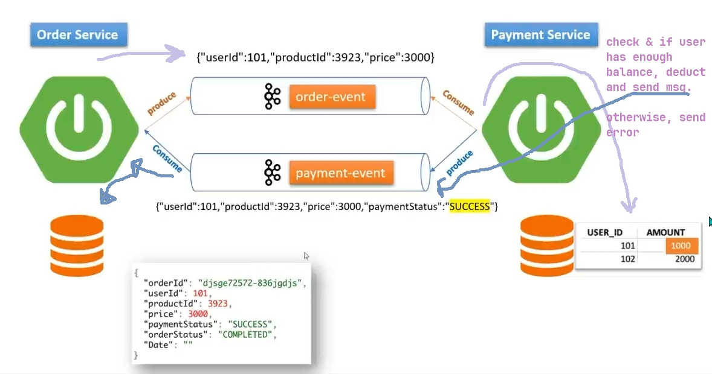

# SAGA - Choreography

## Introduction

## Use-case

when a user places an order, order will be fulfilled
if the product's price is within the user's
credit limit/balance. Otherwise, it will not be fulfilled.

Let's explain further.

In **Monolithic** approach, we have order and payment service in one place
and they both have the same db. So if the user doesn't have enough balance,
the purchase won't get persisted, neither the user's amount be deducted. It'll roll back.

But in **Microservice** approach, each service is separate and have their own db.
So we have two problems :

1. to communicate, we have to expose http requests |=> (suppose
   we add more services later on, we'll have to make n number of
   http requests for each of them.)
2. since it is each service has their own db, if one of the services
   is in the downtime, maybe the user's amount will get deducted, but
   since the other service is down, the purchase won't get persisted, and
   it'll cause great issues.

So to overcome this issue, we have SAGA pattern. SAGA pattern can be implemented
with 2 approaches : _Choreography_ & _Orchestration_.

## Choreography

In choreography approach there is no http requests. Instead, we use event sourcing.

   

### Tech Stack
We can achieve this pattern by using these tech stacks :

- Spring WebFlux
- Spring Cloud Stream
- [Apache Kafka](../../../../Java%20☕/Spring/EDA-Kafka)
- Java 8

