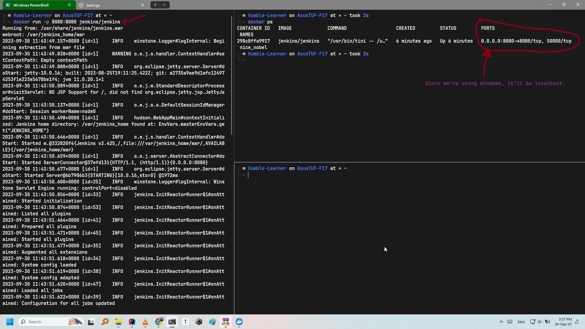

# Docker

<!-- TOC -->
* [Docker](#docker)
  * [Docker commands](#docker-commands)
    * [Basic commands: `docker run`, `docker ps`, `docker rm`, `docker rmi`](#basic-commands-docker-run-docker-ps-docker-rm-docker-rmi)
    * [Basics of `docker run` commands](#basics-of-docker-run-commands)
    * [Port Mapping](#port-mapping)
    * [Volume Mapping](#volume-mapping)
  * [Docker Images](#docker-images)
  * [Environment Variables](#environment-variables)
  * [Docker CMD & ENTRYPOINT](#docker-cmd--entrypoint)
  * [Docker Compose](#docker-compose)
    * [Docker compose - build](#docker-compose---build)
    * [Docker compose - versions](#docker-compose---versions)
    * [Docker compose - networks](#docker-compose---networks)
<!-- TOC -->

## Docker commands

- `docker run <name_of_image>`: runs an image


- `docker run -d <name_of_container>`: runs an image of a container in a DETACHED mode;
- `docker attach <id_of_container>`: will attach the container back to the console.
  the container will run in the background, and you'll be continued by the cmd prompt.


- `docker run <name_of_container>:<version>`: runs a docker container with a **tag**.
    - e.g. `docker run redis:4.0`; here 4.0 is serving as tag
- `docker ps`: list all running containers
- `docker stop <name_or_id_of_container>`: stops a container


- `docker rm <name_of_container>`: remove
- `docker rmi <name_of_image>`: remove an image completely


- `docker pull <name_of_image>`: pulls an image

### Basic commands: `docker run`, `docker ps`, `docker rm`, `docker rmi`

1. `docker run centos`
2. `docker run -it centos bash`; Here We are telling it to run it in a bash file
   and then also log me in that image.
3. Now you will be logged-in in the centos which you can also check the specification of the os using
   `cat /etc/*release*`.
4. run `docker ps`; command to see a list of running containers which it'll be seen empty.
5. `docker run -d centos sleep 20`; run it for 20seconds and in the background.
6. `docker ps -a`; for showing all the containers that have run previously; a history.
7. `docker stop <id_or_name_of_container>`; force stop the container.
8. `docker rm <id_or_name_of_container>`; to remove the container history since it takes storage.
9. `docker rmi <id_or_name_of_container>`; to remove the image entirely, but remember you should first remove the
   container
   from the so-called history. Otherwise, you'll get a conflict error of "container is in use..." or something.

### Basics of `docker run` commands

- `docker run <name_of_image>`: runs an image
- `docker run -d <name_of_container>`: runs an image of a container in a DETACHED mode;
  the container will run in the background, and you'll be continued by the cmd prompt.
- `docker run <name_of_container>:<version>`: runs a docker container with a **tag**.
    - e.g. `docker run redis:4.0`; here 4.0 is serving as tag.
- `docker run -it <name_of_conatiner>`: running a docker application in _interactive_ and _terminal_ mode.
- `docker run -p 8000:3306 <mysql>`: mapping port to the applications.
- `docker run -v /location/to/store/on/your/system:</var/lib/mysql> <mysql>`: when we stop a docker container, we also
  delete all the
  files that has been stored in it (like a db). If we want to store data and not loose it, we can store it in our local
  files by specifying
  the location to store, and the location where the data is being stored (like where the data for db is storing in the
  docker).
- `docker logs <name_of_container>`: suppose you run a docker container in a detach mode, how can we see the logs now?
  to see the logs
  we can run the `<-` command to see the logs.

### Port Mapping

> Let's learn the port and mapping it (Internal & External IP)!
>
> Firstly pull and run the jenkins container (or any other web application or anything that requires a port and host
> server):
> `docker run jenkins/jenkins`
>
> It will run on some port by itself:
>
> 
>
> Now to find out the _Internal IP_ of the jenkins container?:
>
> run `docker inspect <id_of_container>`; which will pull out a json file.
> Scroll down to the ➡️ `Networks` ➡️ `IPAddress`:
>
> 
>
> Now you can access it using the port that you found (172.17.0.2) by specifying port also (8080).
>
> Now how do I access it by the _External IP_?:
>
> You can run the container by specifying an IP address of yourself. Then You can access it via the localhost (in
> windows since we're using docker desktop; otherwise run `docker info` to find out your docker host).
> So it'll be like this:
>
> `docker run -p 8080:8080 jenkins/jenkins`: Now it'll be available on docker's host
>
> 

### Volume Mapping

If we were to stop a container all the data will get removed, and we'll have to do the setup and all the configurations
from the start.

In order to persist configuration data across docker containers (save file into your local system) you need to map
a `volume`.

> Run the container by specifying the volume and a user(can be anything):
>
> `docker run -p 8080:8080 -v /location/where/you/want/to/store/data:/var/jenkins_home -u <specify_any_name> jenkins/jenkins`:
>
> e.g.
>
>   - `-v //C/Users/aliro/dockerData/jenkins_data`: is the folder where I want to store the data
>   - `:/var/jenkins_home`: is where the default data is stored
>   - `-u root`: is for giving a user since it'll complain about not having permission
>
> 
>
> Now we can access jenkins webpage with the previous saved data.

## Docker Images

Why do we need to create our own images? because, we might want to containerize our own application fore ease of
shipping everywhere.

How to create our own image?


Let's talk more about the docker file:


The steps to install and set up a new application:

- `apt-get install -y python3`
- `apt-get install python3-pip`
- `pip3 install flask`
- create/copy application source code to: `/opt/app.py`
- `FLASK_APP=app.py flask run --host=0.0.0.0`

Now we'll follow the same steps and create a docker file:

1. Specify and go into the path where you want to create the dockerfile.
2. Create a `Dockerfile`.
3. Create/Copy the application code in the same directory as the Dockerfile.
4. Write the following code as said above (in the steps):
    - Creating the docker file<br>
      ```dockerfile
      FROM ubuntu
      
      RUN apt-get update
      RUN apt-get install -y python3 python3-pip
      RUN pip3 install flask
      
      COPY app.py /opt/app.py
     
      ENTRYPOINT FLASK_APP=app.py flask run --host=0.0.0.0
    - Now build the docker image with a tag to specify the name: `docker build . -t <specify_a_name>`
    - Now run `docker images` and you can see that the docker image is now ready.

## Environment Variables

Some applications have environment variables. We can run container(s) while also setting up those environment variables
at the same time.

`docker run -e THE_NAME_OF_ENVIRONMENT_VARIABLE=some_value <name_of_container>`

e.g.
&nbsp;&nbsp;&nbsp;&nbsp;&nbsp;&nbsp;&nbsp;&nbsp;&nbsp;&nbsp;&nbsp;&nbsp;&nbsp; `docker run -e APP_COLOR=green java-mvc-demo`

But a question; How do you find the environment variables that's set on a container that's already running??

Use `docker inpect <name_of_container>` command and scroll down to "Config" section:


## Docker CMD & ENTRYPOINT

We may want to run some specific commands for some containers. We may want to make a container to run for a period of
time and then stop. We can achieve this by:

```dockerfile
FROM ubuntu

CMD sleep 10 (or ["sleep","10"]
```

> Now the container will run and will stay awake for 10 seconds: `docker run ubuntu-sleeper`

> If we run `docker run ubuntu-sleeper sleep 20`: it will override the sleep command.

<br>
There's another scenario where you may want to specify the time for yourself; you can achieve that by using "ENTRYPOINT":

```dockerfile
FROM ubuntu

ENTRYPOINT sleep (or ["sleep"])
```

> Now run the container: `docker run ubuntu-sleeper 15` which will run for 15 seconds

> If we run `docker run ubuntu-sleeper` without specifying any parameter: the program will crash.
 
>> As you can see, if we don't specify a default value, we may crash into errors. That's where we specify a default value:
>> 
>> ```dockerfile
>> FROM ubuntu
>> 
>> ENTRYPOINT ["sleep"]
>> 
>> CMD ["5"]
>> ```
>>> Remember; It should in JSON format in this scenario. 
>>
>> This way, command instruction will get appended to the entrypoint instruction. 
>> 
>> Let's say you also want to override the entrypoint command:
> 
> `docker run --entrypoint sleep2.0 ubuntu-sleeper 10`
 
## Docker Compose
Suppose we have an application that requires multiple docker containers to run. It is not recommended to run multiple 
docker containers manually. This is where a `docker compose` into the picture.

Let's demonstrate it with this example:::-


We can create a docker-compose.yaml file. This will be the structure::


### Docker compose - build
Supposing that some of the images are not available officially; 
we can specify that those specific images should be built from the designated folder/path.

Like So:


### Docker compose - versions


### Docker compose - networks

