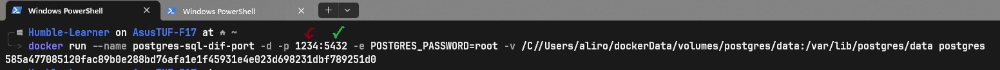
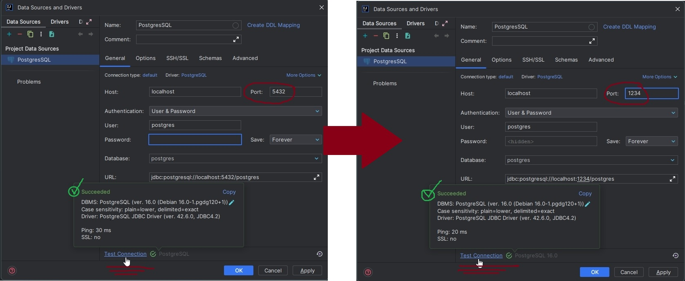

# Docker

<!-- TOC -->
* [Docker](#docker)
  * [Container](#container)
  * [Docker commands](#docker-commands)
  * [Docker Volume](#docker-volume)
  * [Connecting Docker Container To Application](#connecting-docker-container-to-application)
    * [Exposing host (so that we connect to the containers)](#exposing-host-so-that-we-connect-to-the-containers)
  * [Dockerfile](#dockerfile)
    * [Packaging our spring-boot application into docker image](#packaging-our-spring-boot-application-into-docker-image)
  * [Docker Networking](#docker-networking)
  * [Docker Compose](#docker-compose)
<!-- TOC -->

## Container


Containers have these benefits:

- consistency
- portability
- resource efficiency
- scalability
- versioning and rollback


## Docker commands

> What if we want to **run an already existing container**?
>
> `docker start <the_id_of_container>`

> What if we want to see the **logs of a running container**?
>
> `docker logs <the_name_of_conatainer>`

> What if we want to **continue listening on the logs of a running container**?
>
> `docker logs -f <name_of_container>`

> What if we want to **run some commands inside the container**?
>
> we need to run that container in interactive
> mode: `docker exec -it <container_name> <the mode how we want to connect>`
>
> e.g. `docker exec -it objective_keller psql -U postgres`

> What if we want to run a docker container **with our own custom name**?
>
> `docker run --name <specify_name> <container_name>`

> What if we want to **run it in detached mode**?
>
> `docker run -d <container_name>`

> What if I want to **remove a container**?
>
> `docker rm <container_id(s)>`

> What if I want to **remove an image**?
>
> `docker rmi <image_name(s)>`

## Docker Volume

When a container stops, the data will also be lost alongside it.
To prevent this loss of data, we can define a volume for the container;
so that all the data will get replicated in the physical hard disk and the data
will be saved in our own specified path.

Different types of data volume:


## Connecting Docker Container To Application

Let's suppose we want to connect PostgresSQL with our application. If we try to connect as it is
now, we won't be able to because that postgres container is running in its own isolated environment.
We need to expose host and port for the container so that we can connect to the docker's environment.


### Exposing host (so that we connect to the containers)


Let's run another instance of the same container on another port (host's port).




Now we can try to connect our application to postgres on any of the 5432 or 1234.



## Dockerfile

A series of command to specify how to build your application as a docker image.


### Packaging our spring-boot application into docker image

In order to package our application;

1. package our application: `./mvnw clean package`
2. we need to create a `Dockerfile` on the root folder. 
3. 
4. This application will fail to run and the cause is that postgres cannot connect
to the application. To resolve this; Network!

### Packaging our spring-boot application into docker image - BingYang Wei

[the source](../Dockerfile-bingyangwei)

the reason is :


 

## Docker Networking
**How can we communicate different docker containers between each other?**

1. First let's change the db connection from `localhost` to `the_name_of_postgres_container`:

2. Now build the jar and docker image again.

**How to create networks or connect containers to the same network?**

- `docker network ls`: list all the network that we have.
- `docker network create <specify_name>`: creates a new network.
- `docker nework connect <network_name> <container_name>`: connects a running container to the specified network.
- `docker run --net <network_name> <image_name>`: connects an image to a network. 
> Don't forget to specify the port otherwise we cannot connect to the application:
> 
> e.g. `docker run -p 8080:8080 --net spring-boot-network seyedali01/docker-postgres-demo`

## Docker Compose
1. Create a `docker-compose.yml` file in the root folder of your project.
    ```dockerfile
    services:
      postgres:
        container_name: postgres-sql
        image: postgres
        environment:
          POSTGRES_USER: root
          POSTGRES_PASSWORD: root
          POSTGRES_DB: demo_db
        ports:
          - "5432:5432"
          - "1234:1234"
        volumes:
          - postgres:/var/lib/postgres/data
        networks:
          - spring-boot-network
    
      spring-boot-app:
        container_name: sb-postgres
        image: seyedali01/sb-postgres
        ports:
          - "8080:8080"
        networks:
          - spring-boot-network
        depends_on:
          - postgres
    
    volumes:
      postgres:
    
    networks:
      spring-boot-network:
        driver: bridge
    ```
2. `docker-compose up`: to run the docker images.
3. `docker-compose down`: to stop the running containers.
4. 

<br><br><br>