# MultiThreading

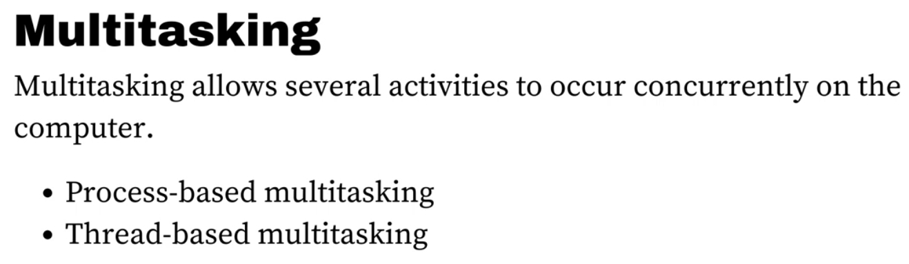

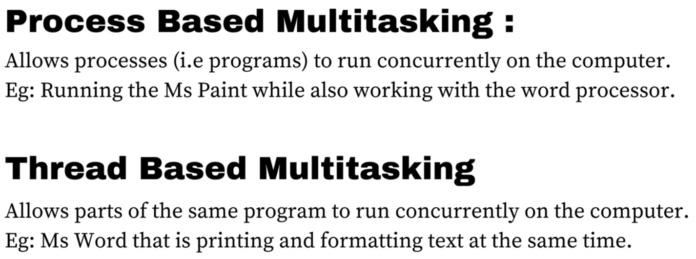

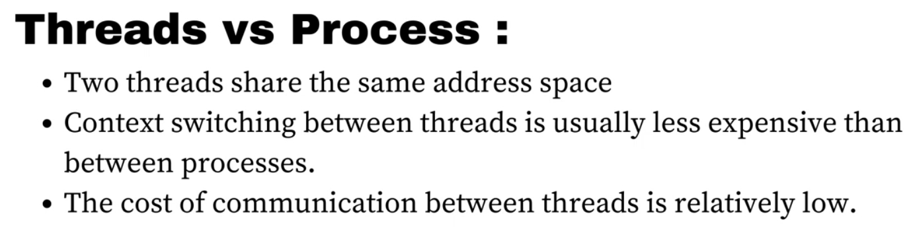

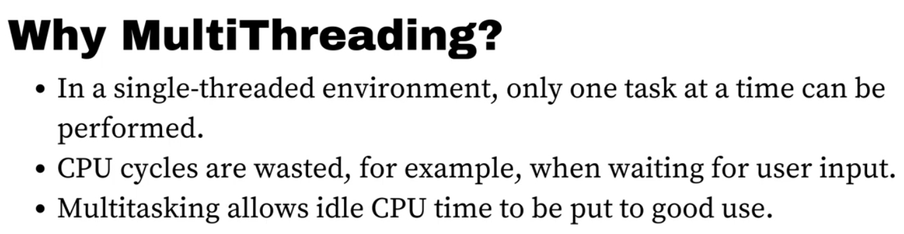

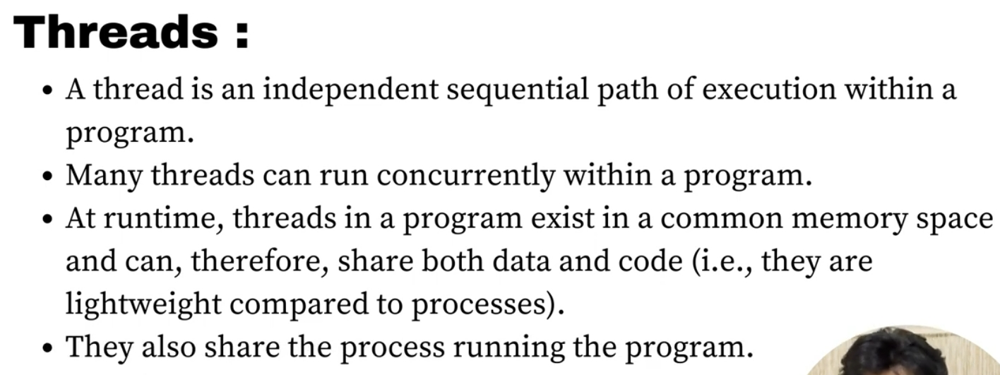

## The Main Threads

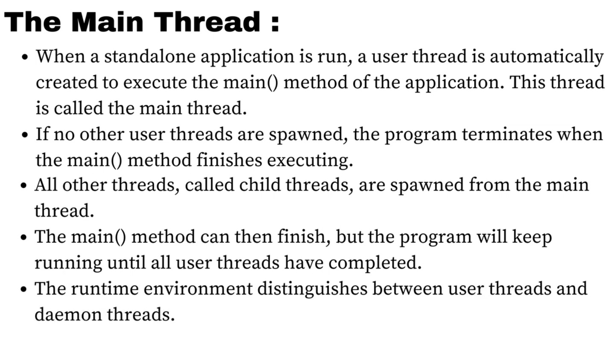

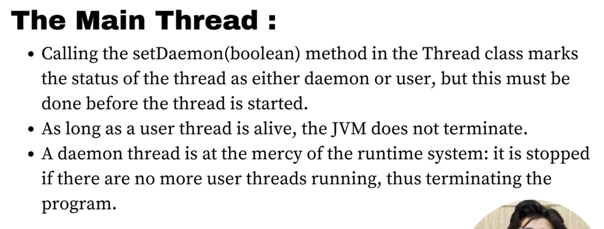

> So you should remember; the program continues to run until a user thread exist,
> otherwise it's up to the mercy of the JVM to let the daemon thread run or not.
> It might terminate the program immediately.

## Thread Creation

1. By extending the `Thread` class.
   

   A simple example:

   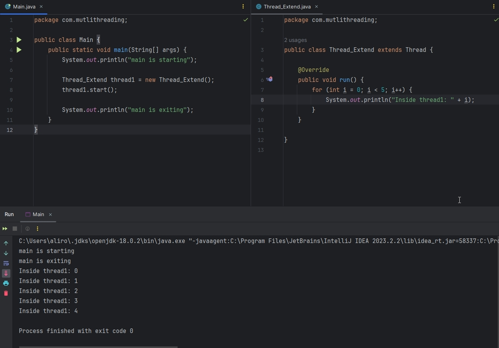

   But as I said earlier; if there is no user thread it's up to the JVM to
   terminate or continue the program:

   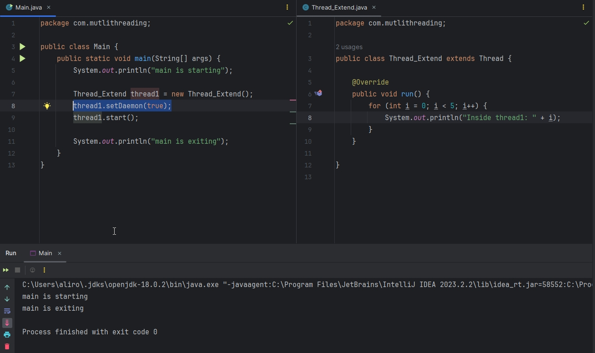

2. By Implementing the `Runnable` interface.

   

   > You might be asking; which method of thread-creation should I choose?
   >
   >    Well, since java doesn't support multiple class extending, but does support
   > multiple interface inheriting, then obviously the `Runnable` interface method is more
   > recommended (Bcuz your class might want to extend some other classes).

   > Also, instead of creating a new class and inheriting `Runnable` interface and overriding
   > `run()` method, we can use functional programming!
   >
   > Just pass the implementation that you wanted
   > to put in the `run()` method in the `lambda`.

## Synchronization 
 
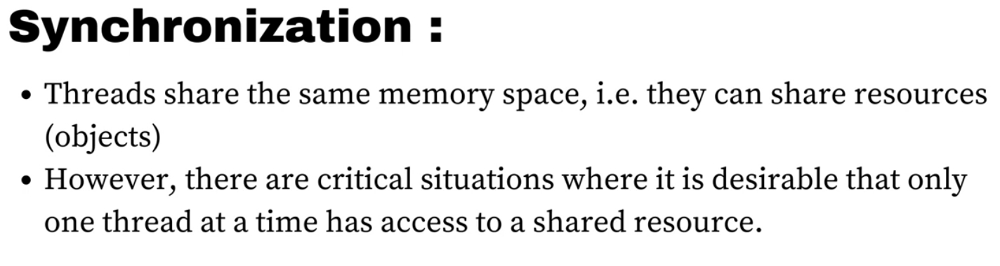

Let's take an example of the second point; critical situation for one thread at a time.

Let's say you are building a ticket-reserving application. Each time someone books a ticket,
the remaining_seat variable is decremented by 1. Let's say there is only 1 remaining_seat. `Thread1` 
will proceed to book that ticket (suppose booking ticket is time-consuming; db operation), until then 
`Thread2` or/and `Thread3` or/and ... will also find the remaining_seat as 1 since the operation from
`Thread1` is not finished and the variable is not decremented. 

This is called: `Race Condition`

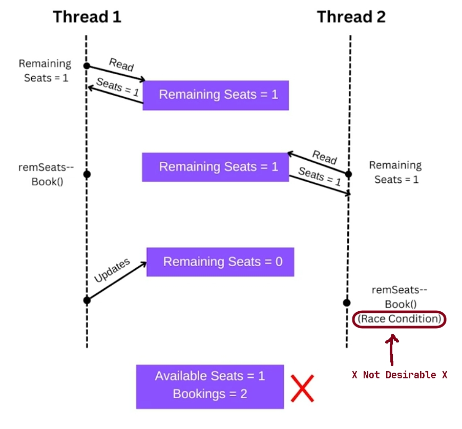