# Event Driven Architecture (using apache kafka)

<!-- TOC -->
* [Event Driven Architecture (using apache kafka)](#event-driven-architecture-using-apache-kafka)
  * [What is event-driven architecture?](#what-is-event-driven-architecture)
  * [Overview of EDA](#overview-of-eda)
  * [What are the advantages of EDA?](#what-are-the-advantages-of-eda)
  * [What is Kafka?](#what-is-kafka)
  * [Why Do We Need Kafka?](#why-do-we-need-kafka)
  * [Kafka Components](#kafka-components)
    * [- Producer, Consumer & Broker](#--producer-consumer--broker)
    * [- Cluster](#--cluster)
    * [- Topic](#--topic)
    * [- Partitions](#--partitions)
    * [- Offset](#--offset)
    * [- Consumer Groups](#--consumer-groups)
    * [- Zookeeper](#--zookeeper)
  * [Kafka Ecosystem](#kafka-ecosystem)
  * [Install Kafka Using Docker](#install-kafka-using-docker)
  * [Kafka Setup & Run](#kafka-setup--run)
  * [Kafka CLI (skip this)](#kafka-cli-skip-this)
  * [Kafka Producer](#kafka-producer)
    * [Configure Kafka Producer In OrderService](#configure-kafka-producer-in-orderservice)
    * [Let's Create **Kafka Topic**](#lets-create-kafka-topic)
    * [Let's Create **Kafka Producer**](#lets-create-kafka-producer)
    * [Let's Create **REST API For Kafka Producer**](#lets-create-rest-api-for-kafka-producer)
  * [Kafka Consumer](#kafka-consumer)
    * [Configure Kafka Consumer In StockService](#configure-kafka-consumer-in-stockservice)
    * [Let's Create **Kafka Consumer**](#lets-create-kafka-consumer)
<!-- TOC -->

## What is event-driven architecture?

Event-driven architecture (EDA) is a software design pattern in which
decoupled applications can **asynchronously** publish and subscribe to events
via an event/message broker.

In an Event-Driven Architecture, applications communicate with each other
by sending and/or receiving events or messages Event-driven architecture is often referred to as "asynchronous"
communication.

Event-driven apps can be created in any programming language because event-driven is a programming approach, not a
language.

An event-driven architecture is loosely coupled.

## Overview of EDA

<p align="center">
  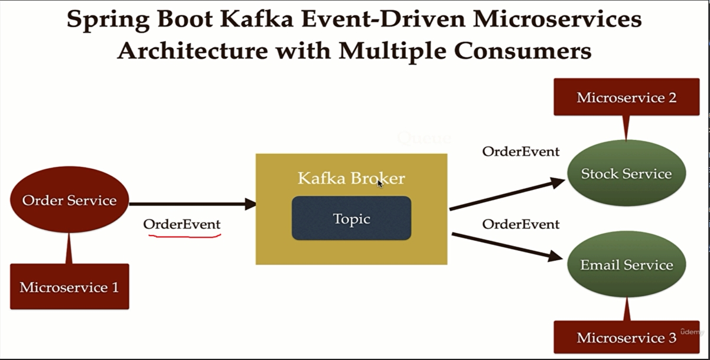
</p>

## What are the advantages of EDA?

- Improved flexibility and maintainability.
- High scalability : we can easily add more microservices.
- Improved availability : if one microservice goes down, it won't affect others.

## What is Kafka?

Apache kafka is an open-source

- distributed <span style="color: teal">*</span>
- event-streaming <span style="color: teal">*</span>
    - create real-time stream
    - process real-time stream

platform.

What do these terms mean?

- **Distributed** : In microservices, distribute means; reducing the load and balancing the load to avoid downtime.
  The same goes for kafka; It is a distributed broker which can have multiple servers.

- **Event-Stream**
    - Create real-time stream : Let's assume an example. You may use Paytm. Hundreds of user send stream of data in a
      short amount of time. This means hundreds of events are being sent to kafka server.
      This is called _creating real-time stream_.
    - Process real-time stream : Let's assume each user is only allowed to do 10 transactions each day. We need a client
      to listen to the kafka events and process every event for the transaction limit. This is called _processing
      real-time stream_.

## Why Do We Need Kafka?

Let's go with this analogy; I have a post which needs to be delivered to me. I'm on a vacation so when the postman
comes, he/she cannot find me, so he'll take the post parcel back to the office. In this case I'm loosing my post/data.
What can we do is put a letter box in front of my house so that if I was not present he/she can put the post inside the
letter box. In this way I don't lose any data.

Let's relate it to a real world example.

<p align="center">
    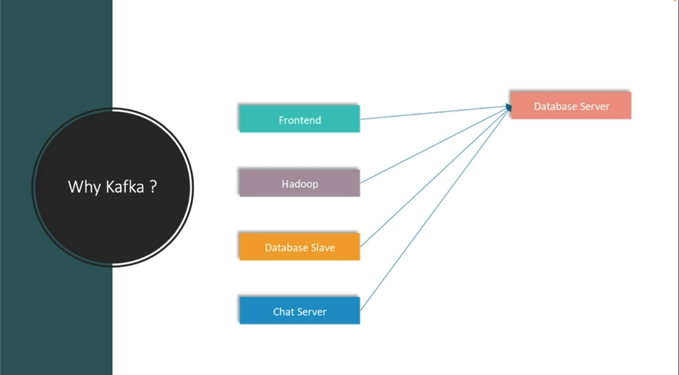
</p>

Here we have 5 applications, and it is quite simple to communicate and transfer data.
But what if we grow in the future? :

<p align="center">
    
</p>

* Data Format : maybe `front-end` different payloads to `database-server` and `security-system`.
* Connection Type : it will be complex to maintain connection type of different connections (tcp, http, jdbc, ...) of
  multiple services.
* Number Of Connection : in this pic, we have total of 20 connections, although we only have 9 applications.

This is where we need kafka.

<p align="center">
    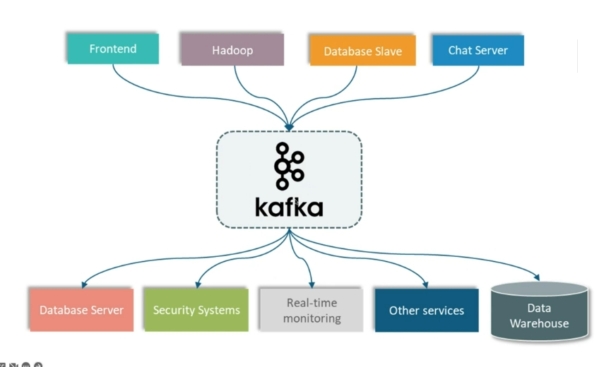
</p>

## Kafka Components

These are all the components of kafka that we need to learn and understand :

1. Producer
2. Consumer
3. Broker
4. Cluster
5. Topic
6. Partitions
7. Offset
8. Consumer Groups
9. Zookeeper

### - Producer, Consumer & Broker

<p align="center">
    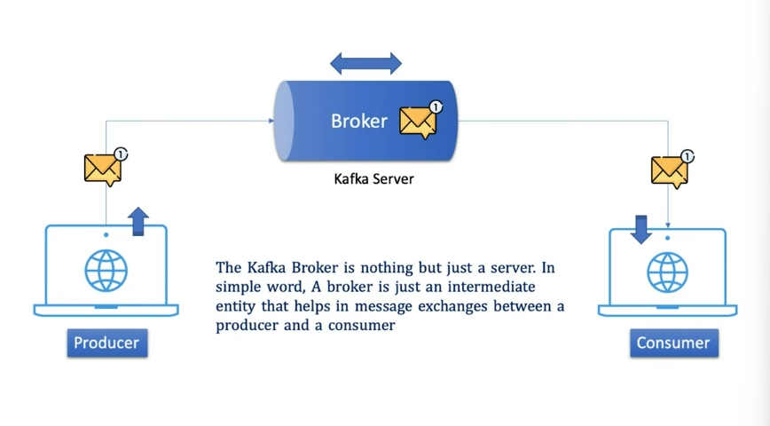
</p>

### - Cluster

<p align="center">
    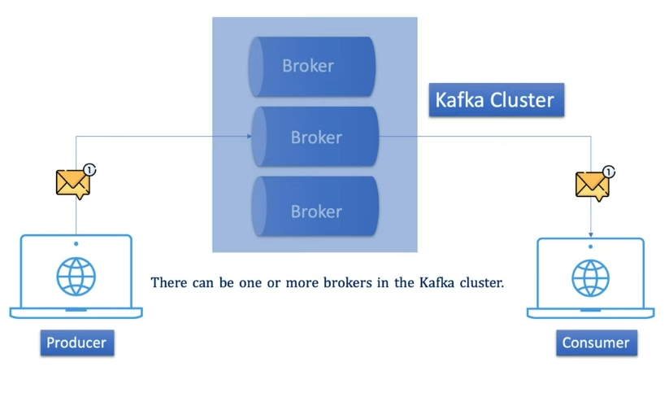
</p>

### - Topic

First let's understand the problem :

<p align="center">
    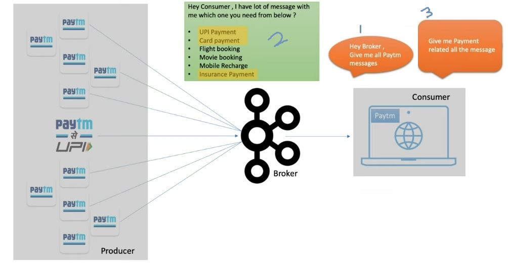
</p>

Now the topic comes into picture :

<p align="center">
    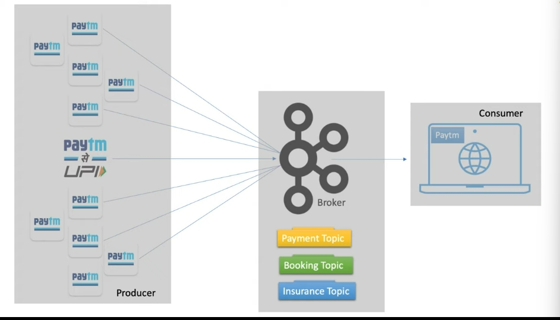
</p>

You can understand it as the db table.

<p align="center">
    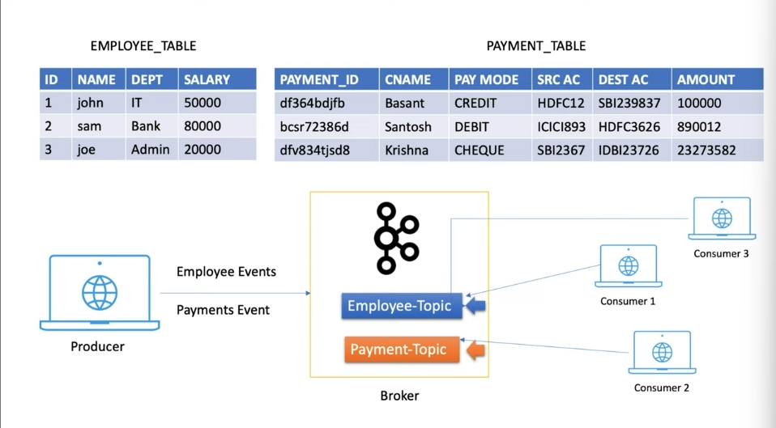
</p>

So the official definition : It specifies the category of the message or the classification of the message.
Listeners can then just respond to the messages that belong to the topics they are listening on.

### - Partitions

<p align="center">
    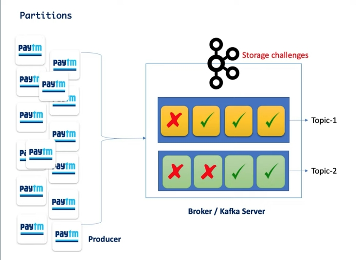
</p>

### - Offset

<p align="center">
    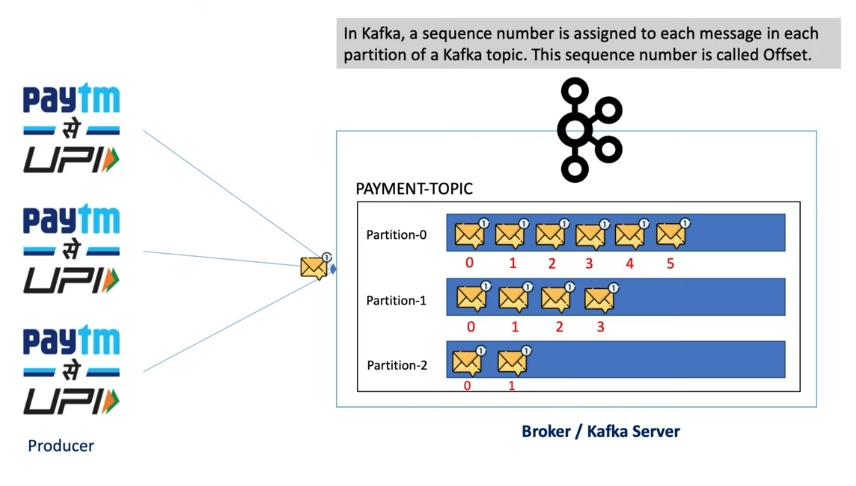
</p>

<p align="center">
    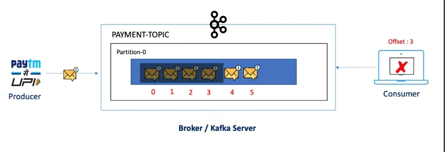
</p>

Suppose the server goes down. After the server starts up, it'll know where to start from. 

Like in this image, it will start from message 4.

### - Consumer Groups

<p align="center">
    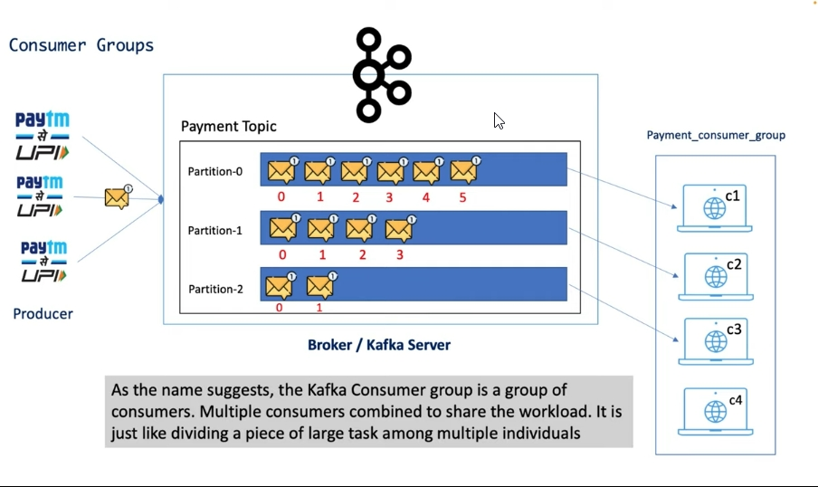
</p>

### - Zookeeper

Zookeeper is a prerequisite for Kafka. Kafka is a distributed system, and it uses Zookeeper for coordination and to track
the status of Kafka cluster nodes. It also keeps track of Kafka topics, partitions, offsets, etc.

<p align="center">
    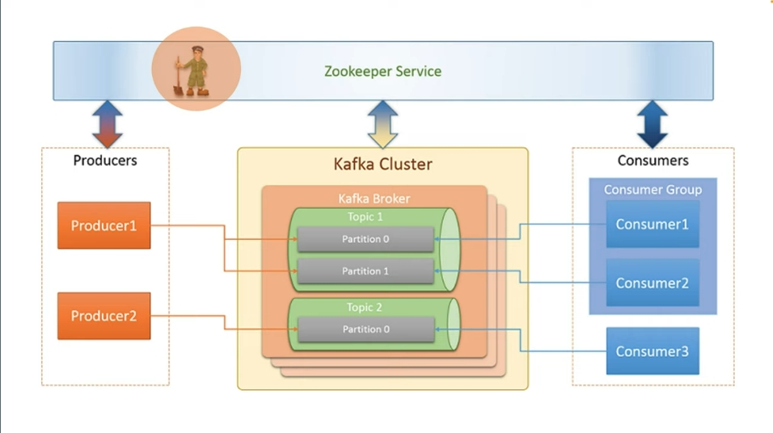
</p>

## Kafka Ecosystem

<p align="center">
    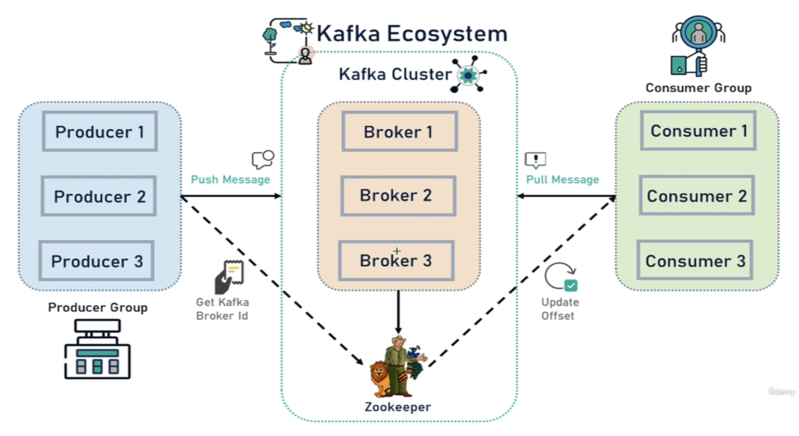
</p>

Let's break the image:

* ZooKeeper : it is a service that manages the state of all the brokers, also the topics, producers and consumers.

  > So remember to start the zookeeper to be able to manage the kafka.

## Install Kafka Using Docker

We'll use `docker-compose.yml` file.

The source code : [docker-compose.yml](./code_source/Install-Kafka-With-Docker/docker-compose.yml)

## Kafka Setup & Run

First download the zip file and extract in the base directory of your C drive (windows).

Open terminal inside the extracted kafka folder and run these commands in separate terminals:

> 💡 Run these commands in order; the zookeeper needs to be run first!

```bash
bin\windows\zookeeper-server-start.bat .\config\zookeeper.properties
 
bin\windows\kafka-server-start.bat .\config\server.properties
```

/* skip this!
> 💡 Run kafka without zookeeper :
> 
> <p align="center">
>    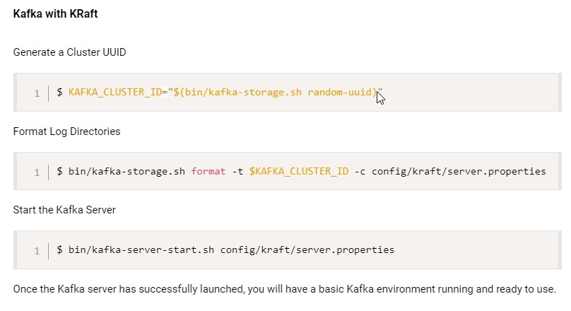
> </p>
> 
> The Commands :
> ```bash
> KAFKA_CLUSTER_ID="$(bin/kafka-storage.sh random-uuid)"
> ```
*/

## Kafka CLI (skip this)

// not completed! skip this part

> 💡 Keep in mind that the default port for :
> 
> Zookeeper : 2181
> 
> Kafka Server/Broker : 9092

Let's work with kafka using command line. What we'll learn :
- creating topics
- partition
- replication (how many copy of kafka server)
- producer
- consumer

```bash
.\bin\windows\kafka-topics.bat --bootstrap-server localhost:9092 --create --topic javatechie-topic --partitions 3 --replication-factor 1
```

Listing all the topics :

```bash
.\bin\windows\kafka-topics.bat --bootstrap-server localhost:9092 --list
```

## Kafka Producer

We'll take this as our project :
<p align="center">
    
</p>

### Configure Kafka Producer In [OrderService](code_source/OrderService/src/)

The code source : [application.yaml](code_source/OrderService/src/main/resources/application.yaml)

```yaml
#kafka producer
spring:
  kafka:
    #bootstrap-servers: localhost:9092
    producer:
      bootstrap-servers: localhost:9092

      #configure serialize classes for key & value pair *
      key-serializer: org.apache.kafka.common.serialization.StringSerializer
      value-serializer: org.springframework.kafka.support.serializer.JsonSerializer

    topic: #this is a custom-made key
      name: order_topics
```

> 💡 We need to configure serializers for key and values; whenever the producer sends an event,
> that event contains the data as key-value pair, and we need to configure the serializers for them.

### Let's Create **Kafka Topic**

The code
source : [KafkaTopicConfig](code_source/OrderService/src/main/java/com/example/orderservice/config/KafkaTopicConfig.java)

Firstly we need to retrieve the topic name, and then create a `NewTopic` bean and a build a topic using `TopicBuilder`.

### Let's Create **Kafka Producer**

The code
source : [OrderProducer](code_source/OrderService/src/main/java/com/example/orderservice/kafka/OrderProducer.java)

> 💡 So overall the steps is :
> 1. Create a msg using `NewTopic` bean (that we configured earlier) & `Message` (using `MessageBuilder`).
> 2. Send the msg to the kafka topic using `KafkaTemplate`.

### Let's Create **REST API For Kafka Producer**

The code
source : [OrderController](code_source/OrderService/src/main/java/com/example/orderservice/controller/OrderController.java)

> 💡 We're simply creating
> an [OrderEvent](code_source/SharedLib/src/main/java/com/example/sharedlib/model/dto/OrderEvent.java) which is a simple
> pojo class, and sending it to the kafka topic.

## Kafka Consumer

StockService & EmailService are our consumers.

### Configure Kafka Consumer In [StockService](./code_source/StockService/src/main)

The code source : [application.yaml](./code_source/StockService/src/main/resources/application.yaml)

```yaml
#kafka consumer
spring:
  kafka:
    consumer:
      bootstrap-servers: localhost:9092
      group-id: stock   #1*
      auto-offset-reset: earliest
      key-deserializer: org.apache.kafka.common.serialization.StringDeserializer
      value-deserializer: org.springframework.kafka.support.serializer.JsonDeserializer
      properties:
        spring:
          json:
            trusted:
              packages: "*"   #2*
    topic:
      name: order_topics   #3*
```

> 💡
>
> 1* : This property is very important; since we have multiple consumers
> (stock and email services consuming from order through kafka) from single topic,
> we need to assign IDs for kafka to recognize them.
>
> 2* : We're telling kafka to trust and deserialize all the packages in the project.
>
> 3* : It is and should be the same name as the one we mentioned
> in [OrderService#application.yaml_line15](./code_source/OrderService/src/main/resources/application.yaml)

### Let's Create **Kafka Consumer**

The code
source : [OrderConsumer](./code_source/StockService/src/main/java/com/example/stockservice/kafka/OrderConsumer.java)

> 💡 And Done! Now if you check your logs, you can see that you have the sent
> data from the order service!

