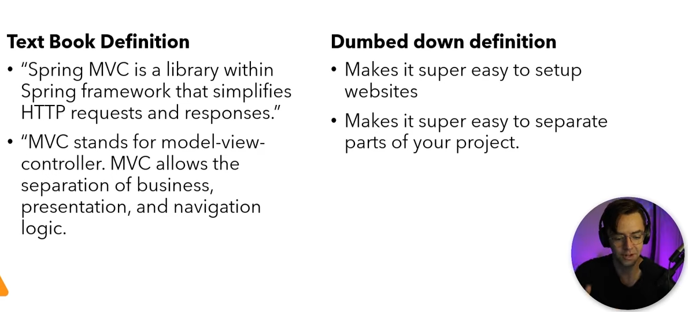
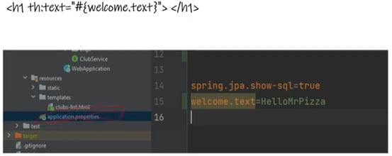
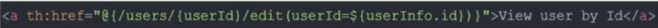
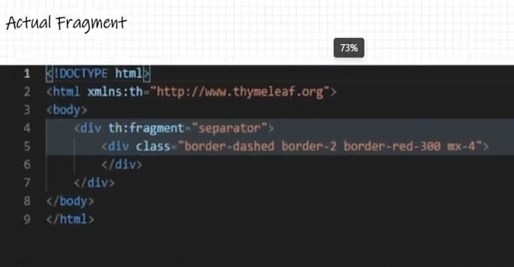
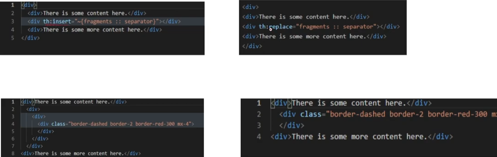

<!-- TOC -->

* [Spring MVC](#spring-mvc)
    * [What is it?](#what-is-it)
    * [Why do we need it?](#why-do-we-need-it)
    * [Spring MVC flow](#spring-mvc-flow)
    * [Spring MVC Execution Flow](#spring-mvc-execution-flow)

<!-- TOC -->

# Spring MVC

## What is it?

Spring MVC(Model-View-Controller) provides a convenient way to develop a java based web application.

It has a central servlet called as DispatcherServlet which is well known as front controller that intercepts all the
requests, identify the appropriate handler i.e. controllers and render views to the client.

It is defined at `org.springframework.web.servlet.DispatcherServlet` in `org.springframework.web` package.

    

## Why do we need it?

It is mostly useful for small applications.

## Spring MVC flow

In Spring Web MVC, `DispatcherServlet` class works as the front controller. It is responsible to manage the flow of the
spring mvc application.

The `@Controller` annotation is used to mark the class as the controller in Spring 3.

The `@RequestMapping` annotation is used to map the request url. It is applied on the method.

## Spring MVC Execution Flow

- **Step 1:** First request will be received by DispatcherServlet.
- **Step 2:** DispatcherServlet will take the help of HandlerMapping and get to know the Controller class name
  associated with the given request.
- **Step 3:** So request transfer to the Controller, and then controller will process the request by executing
  appropriate methods and returns ModelAndView object (contains Model data and View name) back to the DispatcherServlet.
- **Step 4:** Now DispatcherServlet send the model object to the ViewResolver to get the actual view page.
- **Step 5:** Finally DispatcherServlet will pass the Model object to the View page to display the result.

## Thymeleaf

### Thymeleaf Expressions

+ `th:text="${title}"`

+ `th:id="|container-${id}|"`

conditional

+ `th:if="${club.id > 0}"` - `th:unless="${club.name > 0}"`

iteration

+ `th:each="club: ${clubs}"` - `th:text="${club.title}"`

### Selection Expressions

`th:object="userInfo"` - `th:text="*{firstname}"`

### Message Expressions

### Link Expressions

### Fragments

small pieces of reusable code.

insert or replace

delete this line!!!

