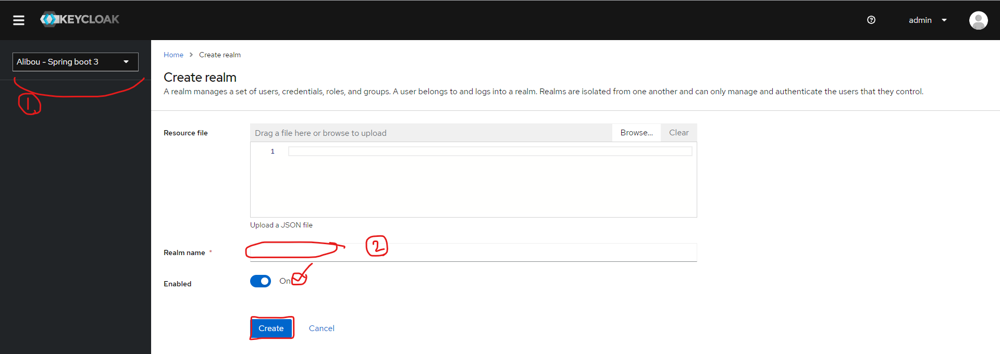
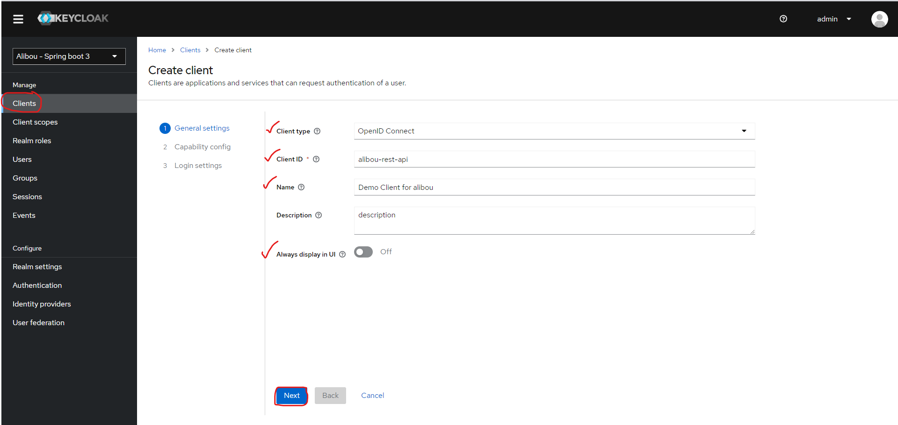
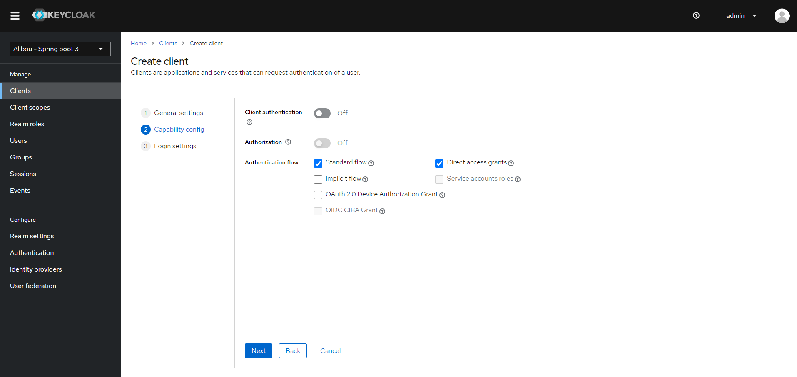
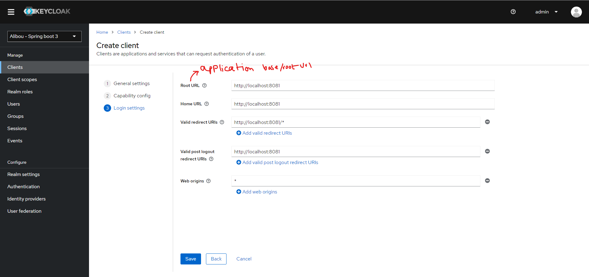

# Alibou - Spring boot 3 KeyCloak

1. Step 1: Run the key cloak and login to `http://localhost:8080`

   <kbd>docker run -p 8080:8080 -e KEYCLOAK_ADMIN=admin -e KEYCLOAK_ADMIN_PASSWORD=admin quay.io/keycloak/keycloak:23.0.7 start-dev</kbd>

2. Step 2: Create a Realm

   

3. Step 3: Create a Client

   
   
   
   
   

4. Step 4: Create users, roles, map the roles.

5. Step 5: Generate a Token for a specific user.

   head to : `http://localhost:8080/realms/{your_realm_name}/.well-known/openid-configuration`
   
   or :
   
   