<!-- TOC -->
  * [1. The First Service](#1-the-first-service)
  * [2. Service Registry](#2-service-registry)
  * [3. Config Server](#3-config-server)
  * [4. Feign Client](#4-feign-client)
    * [Error Handling in Feign Client](#error-handling-in-feign-client)
  * [5. Zipkin & Sleuth](#5-zipkin--sleuth)
  * [6. Api Gateway](#6-api-gateway)
    * [Watch `JavaTechie` Securing Microservices using JWT in ApiGateway](#watch-javatechie-securing-microservices-using-jwt-in-apigateway)
    * [Try to understand `DevVault` ApiGateway and implement it again](#try-to-understand-devvault-apigateway-and-implement-it-again)
  * [7. Circuit Breaker](#7-circuit-breaker)
  * [8. Security (Okta)](#8-security-okta)
    * [Okta Configuration](#okta-configuration)
    * [Spring Configuration](#spring-configuration)
* [Unit Testing - Synchronously](#unit-testing---synchronously)
<!-- TOC -->

[TOC]

Footnote[^contents]


## 1. The First Service


## 2. Service Registry

1. Create eureka **server**

   [source](src_dcb/ServiceRegistry)

    ```yaml
    server:
      port: 8761
    
    #eureka server configs
    eureka:
      instance:
        hostname: localhost
      client:
        register-with-eureka: false # *1
        fetch-registry: false # *2
    ```

   > 💡Note:
   >
   > *1 :: don't make the discovery server register itself in the eureka server
   >
   > *2 :: ?
2. Create eureka **client**

   i. Add the dependency of eureka client in the microservices :
    ```xml
    <dependency>
      <groupId>org.springframework.cloud</groupId>
      <artifactId>spring-cloud-starter-netflix-eureka-client</artifactId>
    </dependency>
    ```
   ii. Configure the properties
    ```yaml
    # eureka configuration
    eureka:
      instance:
        prefer-ip-address: true # ?
      client:
        fetch-registry: true # default is true
        register-with-eureka: true # default is true
        service-url: # the address where this client can connect to (eureka server address | it is a map)
          defaultZone: ${EUREKA_SERVER_URL_ADDRESS:http://localhost:8761/eureka}
    ```

## 3. Config Server

1. Create **ConfigServer** Microservice and enable the config server `@EnableConfigServer`
2. Create GitHub repository (make sure it is public)
3. Create the configuration file in the GitHub and paste all the configurations
4. Add **ConfigClient** dependency in the Microservices

    ```xml
    <dependency>
        <groupId>org.springframework.cloud</groupId>
        <artifactId>spring-cloud-starter-config</artifactId>
    </dependency>
    ```
5. Add **configuration** of _ConfigServer_ in the Microservice

    ```yaml
    # config server configuration
    spring:
      cloud:
        config:
          server:
            git:
    #          uri: https://github.com/sayedxali/configserver-dailycodebuffer.git
              uri: https://github.com/sayedxali/dcb-config-server-delete-this-
              clone-on-start: true
              search-paths: master   # set the default branch name to 'master'
    ```
6. Add **configuration** of _ConfigClient_ in the Microservices

   ```yaml
   # config server configuration
   spring:
     config:
       import: configserver:http://localhost:9296
   ```

## 4. Feign Client

1. Add the dependency to the Microservice
   ```xml
   <dependency>
      <groupId>org.springframework.cloud</groupId>
      <artifactId>spring-cloud-starter-openfeign</artifactId>
   </dependency> 
   ```
2. Enable the **FeignClient** `@EnableFeignClient`
3. Create an interface
   ```java
   @FeignClient(name = "PRODUCT-SERVICE")
   public interface ProductServiceClient {
   
       @PutMapping("/reduceQuantity/{productId}")
       ResponseEntity<Void> reduceQuantity(
               @PathVariable long productId,
               @RequestParam(required = false, defaultValue = "1") Long quantity
       );
   
   }
   ```
4. Use it in you classes as dependency

### Error Handling in Feign Client

1. Create a class and implement `ErrorDecoder` from feign client (it is going to be a bean)
   ```java
   @Slf4j
   public class CustomErrorDecoder implements ErrorDecoder {
   
       @Override
       public Exception decode(String s, Response response) {
           ObjectMapper objectMapper = new ObjectMapper();
   
           log.info("url :: {}", response.request().url());
           log.info("headers :: {}", response.request().headers());
   
           try {
               ErrorResponse errorResponse = objectMapper.readValue(
                       response.body().asInputStream(),
                       ErrorResponse.class
               );
               return new CustomException(
                       errorResponse.errorMessage(),
                       errorResponse.errorCode(),
                       response.status()
               );
           } catch (IOException e) {
               throw new CustomException(
                       "Decoder exception",
                       "INTERNAL_SERVER_ERROR",
                       500
               );
           }
       }
   
   }
   ```
2. Create a configuration class and return a bean of type `ErrorDecoder`
   ```java
   @Configuration
   public class FeignConfig {
   
       @Bean
       public ErrorDecoder errorDecoder() {
           return new CustomErrorDecoder();
       }
   
   }
   ```
3. Create a Handler Advice for catching http exceptions
   ```java
   @ControllerAdvice
   public class RestResponseEntityExceptionHandler extends ResponseEntityExceptionHandler {
   
       @ExceptionHandler(CustomException.class)
       public ResponseEntity<ErrorResponse> handleCustomException(CustomException e) {
           return new ResponseEntity<>(
                   new ErrorResponse(
                           e.getMessage(),
                           e.getErrorCode()),
                   HttpStatus.valueOf(e.getStatus())
           );
       }
   
   }
   ```
   > 💡Another example from **DevVault**:
   > ```java
   > @Slf4j
   > @Component
   > public class TaskErrorDecoder implements ErrorDecoder {
   > 
   >     @Override
   >     @SneakyThrows
   >     public Exception decode(String s, Response response) {
   >         ObjectMapper objectMapper = new ObjectMapper();
   > 
   >         log.error("❌ url: {{}} ❌", response.request().url());
   >         log.error("❌ dst: {{}} ❌", s);
   > 
   >         DevVaultException devVaultException = objectMapper.readValue(
   >                 response.body().asInputStream(),
   >                 DevVaultException.class
   >         );
   >         return new DevVaultException(
   >                 devVaultException.getMessage(),
   >                 devVaultException.getHttpStatus(),
   >                 response.status()
   >         );
   >     }
   > }
   > ```

## 5. Zipkin & Sleuth

## 6. Api Gateway

1. Create a new Microservice `ApiGateway`
2. Add the following dependencies:
    - Api Gateway
    - Config Client
    - Actuator
    - WebFlux
    - Lombok
    - Cloud Bootstrap
    - Eureka Client
3. Configure the properties: [source](src_dcb/ApiGateway)
   ```yaml
   # api gateway configuration
   spring:
     cloud:
       gateway:
         mvc:
           routes:
             - id: ORDER-SERVICE
               uri: lb://ORDER-SERVICE
               predicates:
                 - Path=/order/**
   
             - id: PAYMENT-SERVICE
               uri: lb://PAYMENT-SERVICE
               predicates:
                 - Path=/payment/**
   
             - id: PRODUCT-SERVICE
               uri: lb://PRODUCT-SERVICE
               predicates:
                 - Path=/product/**
   ```

   > 💡Another version:
   > ```yaml
   > # api-gateway configuration
   > # configuration for gateway has been moved to java class -> GatewayConfig
   > spring:
   >   cloud:
   >     gateway:
   >       routes:
   >         - id: AUTHENTICATION-SERVICE
   >           uri: lb://AUTHENTICATION-SERVICE
   >           predicates:
   >             - Path=/api/v1/auth/**
   >             #intercept requests using filter for jwt
   >           filters:
   >             - AuthenticationFilter
   >             - name: RemoveRequestHeader
   >               args:
   >                 name: Authorization 
   > ```
   >
   > 💡 Another version (java base and more details with security): [source](src_dcb/API-Gateway-DevVault)
   > Watch `JavaTechie` for revision.

### Watch `JavaTechie` Securing Microservices using JWT in ApiGateway

### Try to understand `DevVault` ApiGateway and implement it again

## 7. Circuit Breaker

## 8. Security (Okta)

### Okta Configuration

1. Go to Okta Developer
2. Create a new app:

   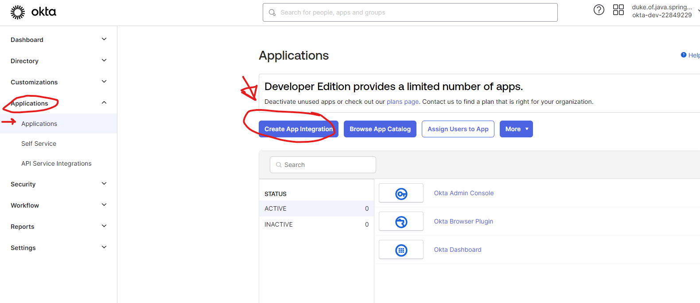
3. Choose OIDC:

   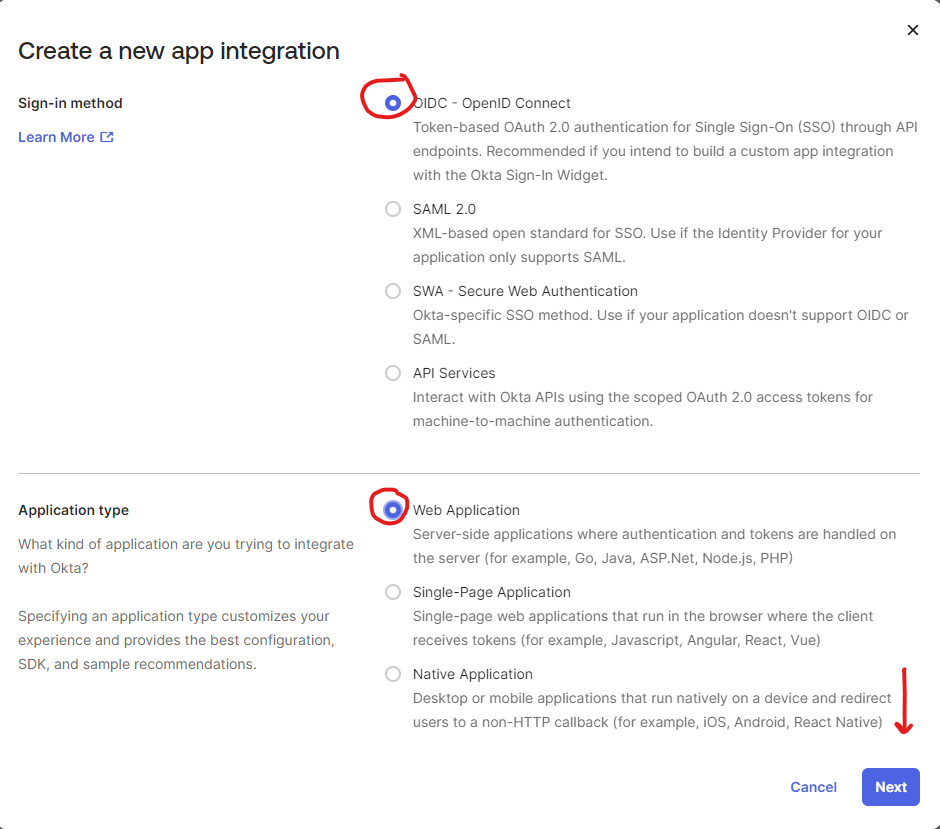
4. ...

   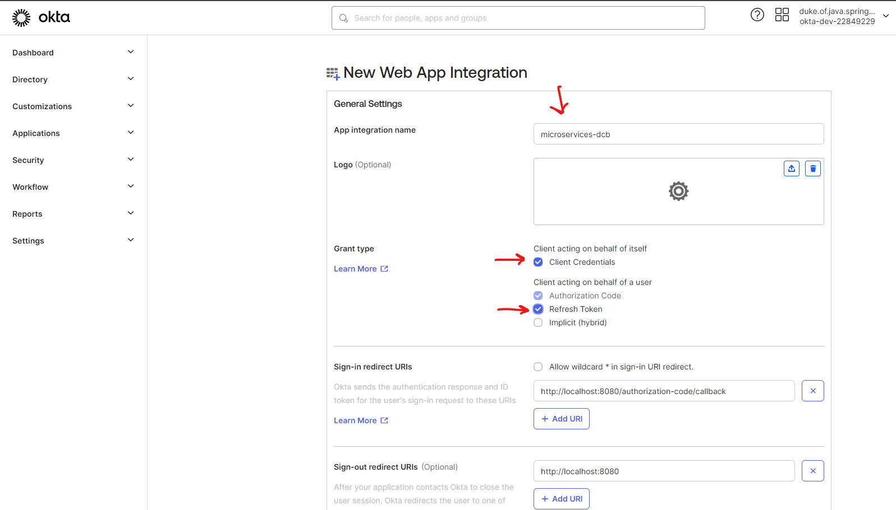
5. Okta Sign-in URI: `http://localhost:8080/login/oauth2/code/okta` =>
   reference: https://developer.okta.com/docs/guides/sign-into-web-app-redirect/spring-boot/main/

   Replace the port `8080` with the port of `ApiGateway`'s port.

   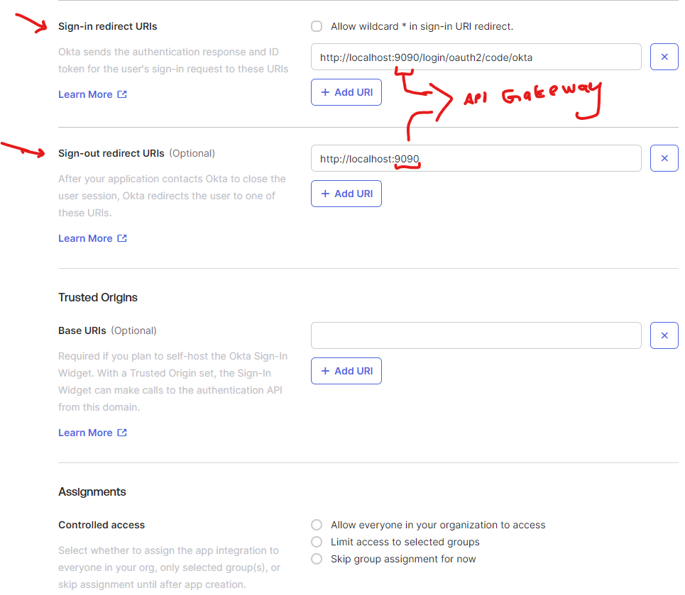
6. ...

   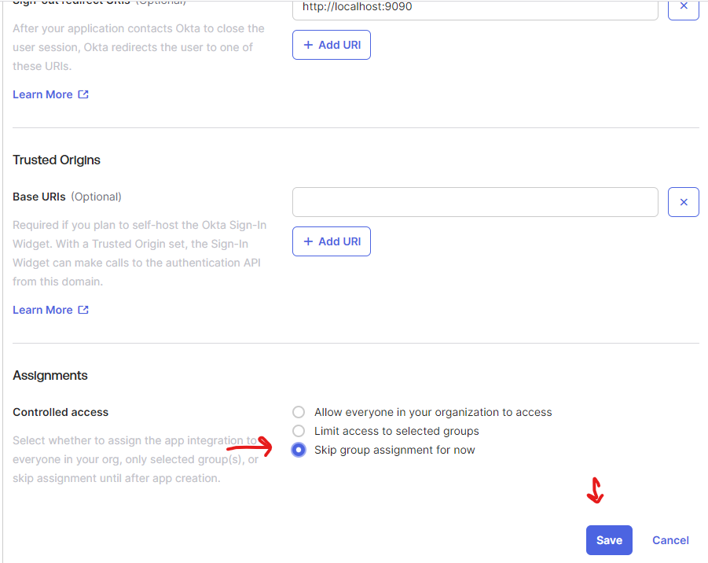
   
   Store the `client-id` and `client-secret`.

7. After the application is created, go to the `security => api` and there we can view our created application.

   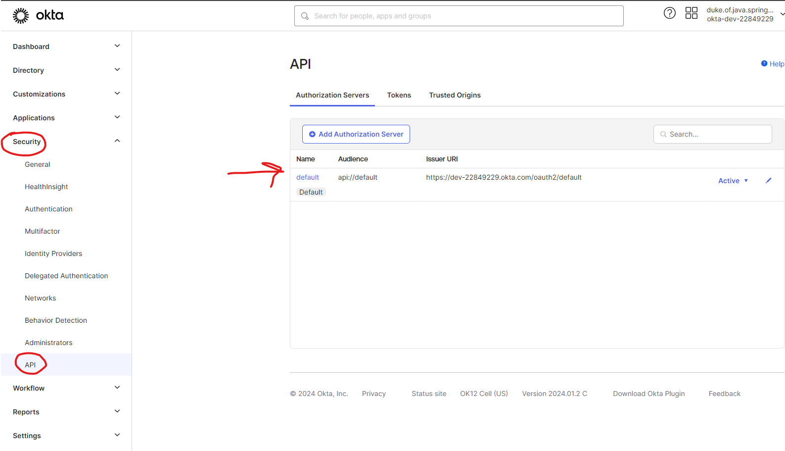
8. Click `default` and then go to `scopes`: we want to create a new scope for internal communication between microservices which is specific to internal communication:

   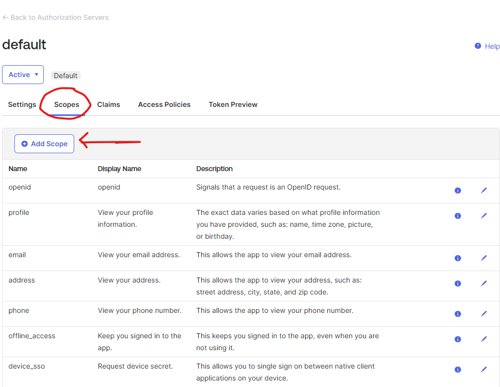

   Just enter a name and leave everything as it is:

   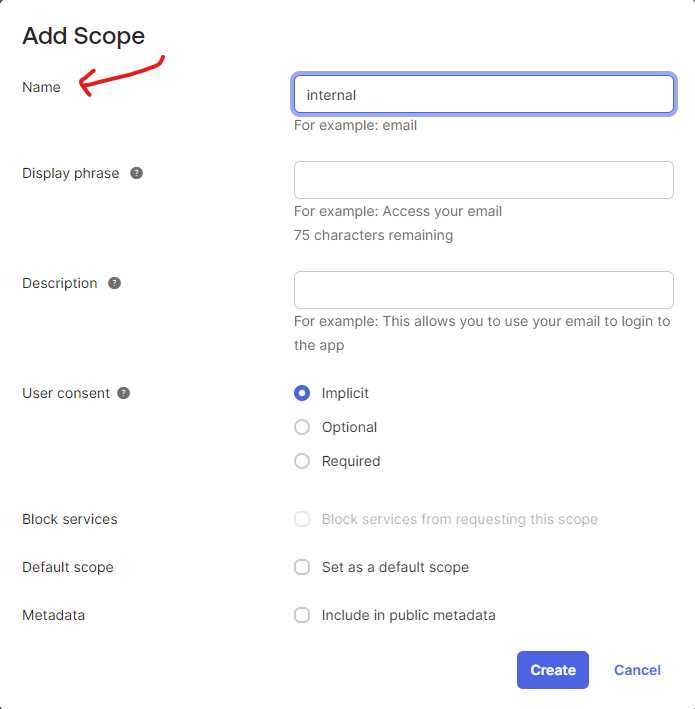
9. Create groups (i.e., roles):

   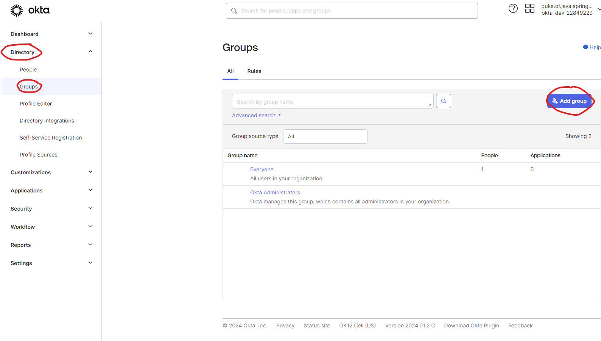

   Also create `peoples` too!
10. Now we want the application to understand the `groups` and `peoples`, so we need to add them to `claims` (`security => api => claims`):

   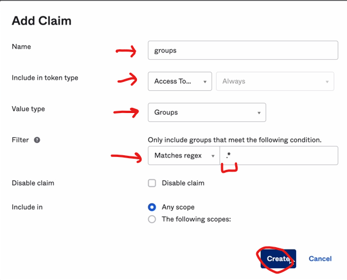

And with that configuration for okta is done! now add dependencies in the application.

### Spring Configuration

1. Add the `security` & `okta` dependencies:
   ```xml
   <dependency>
       <groupId>com.okta.spring</groupId>
       <artifactId>okta-spring-boot-starter</artifactId>
       <version>3.0.6</version>
   </dependency>
   
   <dependency>
       <groupId>org.springframework.boot</groupId>
       <artifactId>spring-boot-starter-security</artifactId>
   </dependency>
   ```
2. Configure the properties (yaml):
   ```yaml
   # okta configuration
   okta:
     oauth2:
       issuer: 
       audience:
       client-id:
       client-secret:
       scopes:
   ```
   We can get this 👆🏻 information from 
   - audience & issuer: `security => api => default`
   - client-id & client-secret: `applications => applications => created_app_name` 
   - scopes: `openid, profile, email, offline_access`
   
   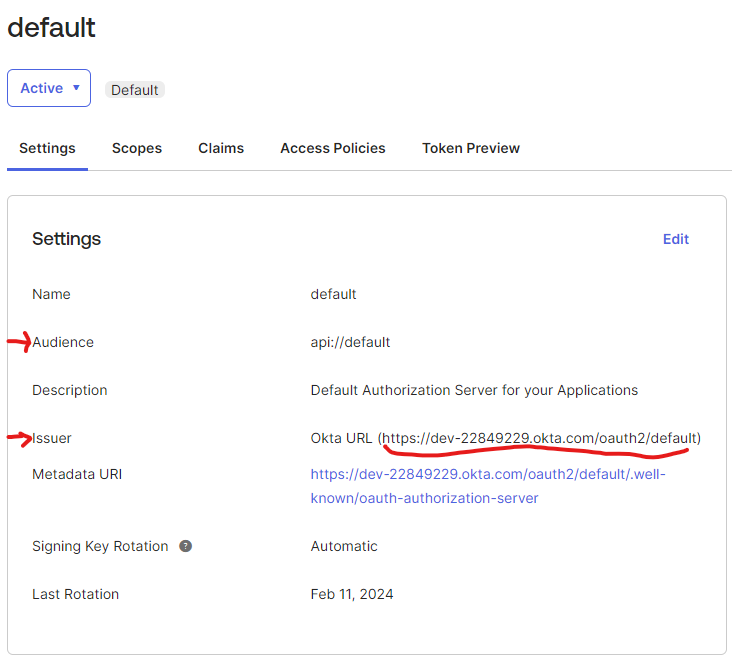
3. Configure the security (java):


self registration:: https://www.baeldung.com/spring-security-okta


# Unit Testing - Synchronously

First of all we need these dependencies:

- spring-boot-starter-test
- spring security test (if project has security)
- wiremock (for mocking REST endpoints)
- h2 database

```xml
<--! wiremock -->
<dependency>
	<groupId>com.github.tomakehurst</groupId>
	<artifactId>wiremock-jre8</artifactId>
	<version>2.35.0</version>
	<scope>test</scope>
</dependency>
    
<--! h2 -->
<dependency>
	<groupId>com.h2database</groupId>
	<artifactId>h2</artifactId>
	<scope>runtime</scope>
</dependency>
```

1. Configure a <kbd>yaml</kbd> file in test and copy paste the configuration from the main <kbd>yaml</kbd> and change the db to `h2`.

   ```yaml
   server:
     port: 8082
   
   spring:
     application:
       name: ORDER-SERVICE
   
     datasource:
       url: jdbc:h2:mem:order
       username: sa
       password: password
       driverClassName: org.h2.Driver
   ---
   # eureka configuration -> from config server
   eureka:
     client:
       enabled: false # for testing purposes
   ---
   # config server configuration
   spring:
     config:
       import: optional:configserver:http://localhost:9296 # 1*
   ---
   # security configuration: will be same as main
   ---
   # resilience4j configuration: no need
   
   ```

   <blockquote alt = 'green'>
       1*: if config server doesn't work, it won't throw exception.</blockquote>

   The [source code](src_dcb/OrderService/src/test)

[^contents]: come back to the first line and contents

