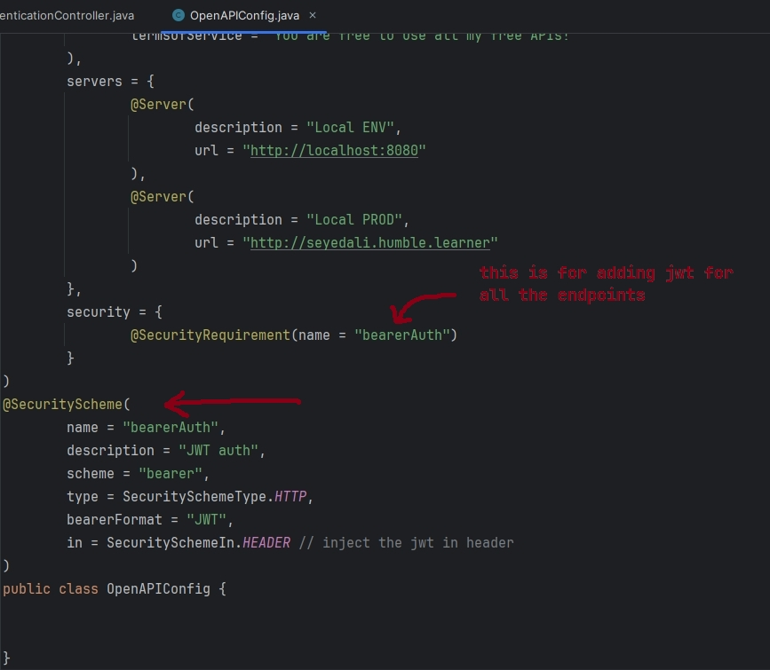
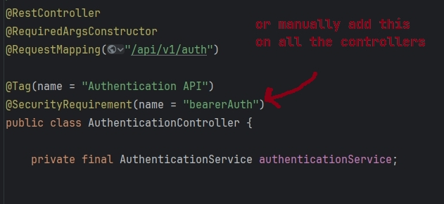
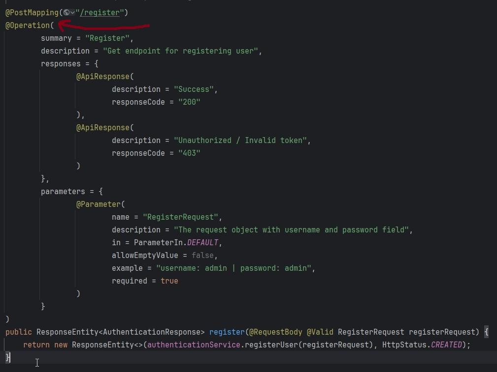

# Spring Swagger

<!-- TOC -->
* [Spring Swagger](#spring-swagger)
  * [What is Swagger?](#what-is-swagger)
  * [Why do we use Swagger?](#why-do-we-use-swagger)
  * [How to add Swagger to Spring Boot application?](#how-to-add-swagger-to-spring-boot-application)
  * [The Source Code](#the-source-code)
<!-- TOC -->

## What is Swagger?

Spring Swagger is an API documentation tool used for documenting RESTful APIs.

## Why do we use Swagger?

- When developing RESTful web services to automatically generate API documentation.
- For documenting existing RESTful APIs.
- During the development and testing phase to interactively test the APIs.

## How to add Swagger to Spring Boot application?

1. Getting the Swagger 2/3 spring dependency:
   > 💡 Note: There are 2 different libraries for generating OpenAPI/Swagger specifications in Spring Boot projects.
   >
   > - SpringFox (older):
   >
   > - supports the Swagger 2.0 specification. It uses Swagger annotations to generate the API docs.
   >
   > - uses Java configuration
   >
   > The dependency for `springfox` was:
   >   ```xml
   >   <dependency>
   >        <groupId>io.springfox</groupId>
   >        <artifactId>springfox-swagger2</artifactId> 
   >        <version>2.9.2</version>
   >    </dependency>
   >   ```

2. SpringDoc (newer):
   > - supports Spring-Boot v3.x
   > - uses autoconfiguration in Spring Boot
   >   - user-friendly UI
   >   - support for Spring Boot features like Actuator endpoints
   >   - more configuration options and flexibility in customizing the API documentation
   >
   >> 💡 SpringDoc is the recommended library for generating OpenAPI specs in new Spring Boot projects as it follows
   better practices, has a more user-friendly UI and supports the latest OpenAPI 3.0 specification 💡
   >
   The dependency for `springdoc`:
   ```xml
   <!-- For Spring-Boot 3.x use springdoc v2.x -->
   <dependency>
      <groupId>org.springdoc</groupId>
      <artifactId>springdoc-openapi-starter-webmvc-ui</artifactId>
      <version>2.2.0</version>
   </dependency>
   
   <!-- We need this dependency since springdoc v3 uses JSR-303 (for validating) -->
   <dependency>
        <groupId>org.springframework.boot</groupId>
        <artifactId>spring-boot-starter-validation</artifactId>
   </dependency>
    
    <!-- For Spring-Boot 2.x use springdoc v1.x -->
    <dependency>
       <groupId>org.springdoc</groupId>
       <artifactId>springdoc-openapi-ui</artifactId>
       <version>1.7.0</version>
    </dependency>
    ```

   Hit this endpoint: `http://localhost:8080/v3/api-docs` to access the JSON format documentation.

   Hit this endpoint: `http://localhost:8080/swagger-ui/index.html` to access the ui format documentation.
3. Configuring Swagger. [The source code](src/main/java/com/example/springswagger/config/OpenAPIConfig.java)
   ```java
      @OpenAPIDefinition(
        info = @Info(
                contact = @Contact(
                        name = "SeyedAli",
                        email = "Sayedxali7@gmail.com",
                        url = "https://github.com/sayedxali"
                ),
                description = "Iam a Java Developer. An aspiring one at that!",
                license = @License(
                        name = "My Licence",
                        url = "uhhhh..."
                ),
                title = "OpenAPI Documentation - Swagger3 :: Spring Security",
                version = "1.0",
                termsOfService = "You are free to use all my free APIs!"
        ),
        servers = {
                @Server(
                        description = "Local ENV",
                        url = "http://localhost:8080"
                ),
                @Server(
                        description = "Local PROD",
                        url = "http://seyedali.humble.learner"
                )
        }
      )
      public class OpenAPIConfig {
      }
   ```
4. Adding details as annotations to APIs.
   ```java
    @RestController
    @RequiredArgsConstructor
    @RequestMapping("/api/v1/auth")
    @Tag(name = "Authentication API") // This annotation has more details
    public class AuthenticationController {          
        
    private final AuthenticationService authenticationService;

    @PostMapping("/register")
    @Operation(summary = "Register") // This annotation has more details
    public ResponseEntity<AuthenticationResponse> register(@RequestBody @Valid RegisterRequest registerRequest) {
            return new ResponseEntity<>(authenticationService.registerUser(registerRequest), HttpStatus.CREATED);
        }
   }
   ```
5. If you are using `Spring-Security`, don't forget to permit the swagger and springdoc urls.
   ```java
    @Bean 
    public SecurityFilterChain securityFilterChain(HttpSecurity http) throws Exception {
           http.csrf(AbstractHttpConfigurer::disable)
                   .authorizeHttpRequests(
                           requestMatcherRegistry -> requestMatcherRegistry
                                   .requestMatchers(
                                           "/api/v1/auth/**",
                                           "/v2/api-docs",
                                           "/v3/api-docs",
                                           "/v3/api-docs/**",
                                           "/swagger-resources",
                                           "/swagger-resources/**",
                                           "/configuration/ui",
                                           "/configuration/security",
                                           "/swagger-ui/**",
                                           "/swagger-ui.html",
                                           "/webjars/**"
                                   ).permitAll()
                                   .anyRequest().authenticated()
                   ).exceptionHandling(httpSecurityExceptionHandlingConfigurer -> httpSecurityExceptionHandlingConfigurer.authenticationEntryPoint(authenticationEntryPoint))
                   .sessionManagement(httpSecuritySessionManagementConfigurer -> httpSecuritySessionManagementConfigurer.sessionCreationPolicy(STATELESS))
                   .authenticationProvider(authenticationProvider)
                   .addFilterBefore(jwtAuthenticationFilter, UsernamePasswordAuthenticationFilter.class)
           ;
           return http.build();
       }
   }
   ```
6. If you are using JWT:

   
   
   or add it manually on all the controllers:
   
   

A few examples:



## The Source Code

The source code : [source](./src/main)
